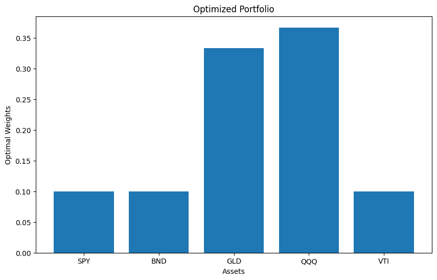
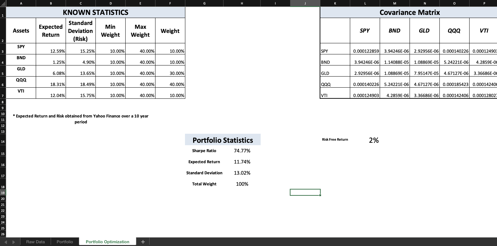
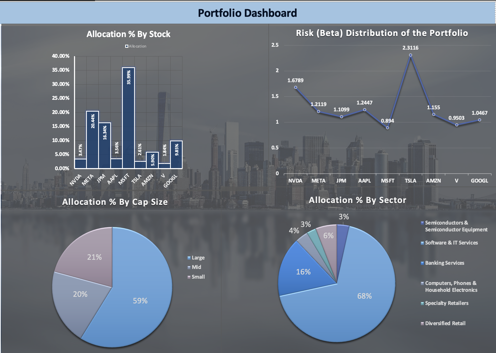
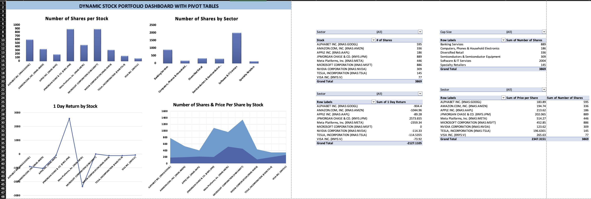

# Stock Portfolio Optimization and Dashboard Using Microsoft Excel
In this project, I decided to take a step back and visit our old friend - MS Excel! In these times, when ML and AI has 
taken over the simple analysis with programming languages like Python, I wanted to explore the power of Microsoft Excel.

## Objective

1. Optimize a Portfolio of five standard stock tickers - SPY,BND,GLD,QQQ, and VTI using - 

  - Python
  - MS Excel

2. Build a Dynamic Stock Portfolio Dashboard with MS Excel using some dummy dataset on the portfolio transactions generated in Python.

## Overview

1. Portfolio Optimization with Python
2. Portfolio Optimization with MS Excel
3. Data Generation with Python and Yahoo Finance API
4. Data Storage and Management with MySQL
5. Data Extraction, transformation, and loading (ETL) MS Excel
6. Data Analysis and Portfolio Creation
7. Portfolio Dashboard development
8. Insights

## Portfolio Optimization

### Data

The data for portfolio optimization is extracted using the Yahoo Financial Python API. In this project, I considered the stock Adjusted Close Prices of five major indicators - 
`SPY, BND,	GLD,	QQQ, and VTI` for over 10 years till date. The same data set is used for optimization in Python and MS Excel. However, I implemented an extra constraint in MS Excel 
which allowed me to assign a few stock to all the tickers without leaving out any.

### With Python

- Utilized the Python SciPy library along with other data analysis libraries (Pandas, NumPy, Matplotlib, Seaborn) and yahoofinancials API
- Obtained an optimized portfolio with the following stock allocations:

 | Stock | Allocation Ratio |
 |---|---|
 | SPY | 0.1000 |
 | BND | 0.1000 |
 | GLD | 0.3331 |
 | QQQ | 0.3669 |
 | VTI | 0.1000 |
 
 

 ### With MS Excel

 - Utilized the Data Analysis Add-in to calculate the covariance matrix and then Solver add-in to maximize the Sharpe ratio by adjusting the weight of each stocks within the constraints.
- Obtained an optimized portfolio with the following stock allocations:

| Stock | Allocation Ratio |
 |---|---|
 | SPY | 0.10 |
 | BND | 0.10 |
 | GLD | 0.30 |
 | QQQ | 0.40 |
 | VTI | 0.10 |
 

### Comparison 
| Python | MS Excel|
|--|--|
| Uses highly efficient computing library SciPy to give a more precise and accurate optimization | Uses the Solver add-in tool to maximize the Sharpe Ratio and give a less accurate optimization|

## Portfolio Dashboard

### Data Generation with Python

An artificial dataset of the transaction log of a portfolio with 10 major stock tickers where created. The dataset followed the below criteria and constraints - 

 - Used data from the Yahoo finance website (https://finance.yahoo.com/) for stock prices.
 - The transaction log contains 500 transactions with the following column names -
   -  Stock Ticker
   -  Transaction - Buy/Sell/Dividend
   -  Date
   -  Quantity - 0 for dividend transaction, negative numbers for sell transaction
   -  Price - 0 for dividend transaction
   -  Dividend - 0 for all except dividend transaction
   -  Total Amount - () for Sell transactions, 0 for dividend transaction
 - The Number of Stocks bought should be always greater than or equal to the number of stocks sold!
 - The dividend should be only from stocks that are in the Portfolio!

### Data Management with MySQL and MS Excel

- The custom generated data was exported to MySQL from Python using the SQLConnect. This enables addition of new data into the database without affecting the previous entries
- The MySQL session was connected to MS Excel using Oracle's Open DataBase Connectivity(ODBC) integrators. This enabled auto-updation of the portfolio with new transactions without affeecting the DAX in MS Excel.

### Dashboards

